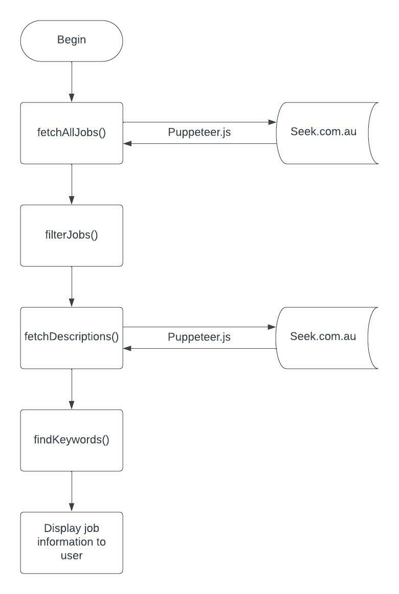

# Job Board Scraper
## Purpose
To aid in the job-seeking process which I'm currently undergoing by allowing me to first scrape all job listings returned by a particular search term on Seek, e.g. 'Junior Developer', then filtering the returned jobs to only show those which actually contain particular words in the job title, e.g. 'junior' or 'graduate'. Furthermore, the application will search through the job descriptions of the filtered list and find user-defined keywords, e.g. 'react', 'MERN', or 'SQL' and display the results to the user along with useful data such as how many jobs mentioned each keyword and which jobs mentioned said keywords.

## User Stories
* As a user, I want to find Graduate Developer job ads which specifically mention technologies which I'm adept at
* As a user, I want to compare the popularity of two competing technologies on the job market to help me to decide which would be more valuable to learn
* As a user, I want to analyse the current job offerings in my field and see which particular skills are in demand
* As a user, I want to compare the job markets between cities and assess which skills are sought after in different markets

## Functions
### fetchAllJobs(searchTerm, location)
Accepts two arguments, 'searchTerm' and 'location'.

'searchTerm' is the job title which the user wishes to search, e.g. 'Senior Software Developer'.

'location' is self-explanatory. If left empty your search will run Australia-wide

A search is then run on Seek and the job title and URL of each job are returned as an object and pushed into an array.

### filterJobs(filters)
Accepts an array of filter terms, 'filters', defined by the user. Only jobs which include at least one of these filter terms will be returned to the user. This step occurs prior to fetchJobDescriptions() as it will significantly reduce the time taken to scrape the description data.

### fetchDescriptions()
Takes the filtered array of objects returned by filterJobs(), visits the URLs of each job and adds the job description to its respective object.

### findKeywords(keywords)
Accepts an array of keywords which the application will attempt to find within the description of each job, and tracks how many of the unique user-defined keywords are present in each job description. Returns an array of job objects which are sorted by those with the highest keyword-presence.

Note: The amount of times that a keyword is mentioned in an advertisement is not relevant, moreso the amount of unique keywords which are included in the job descriptions.

## Program Flow

